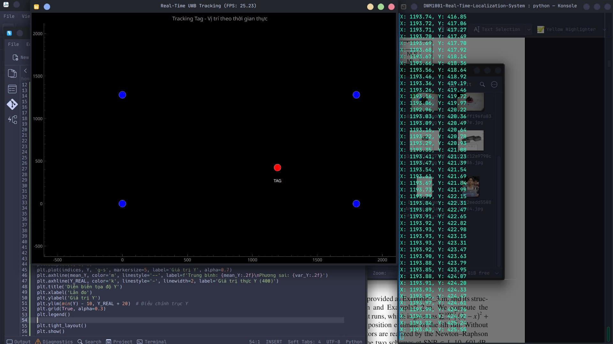
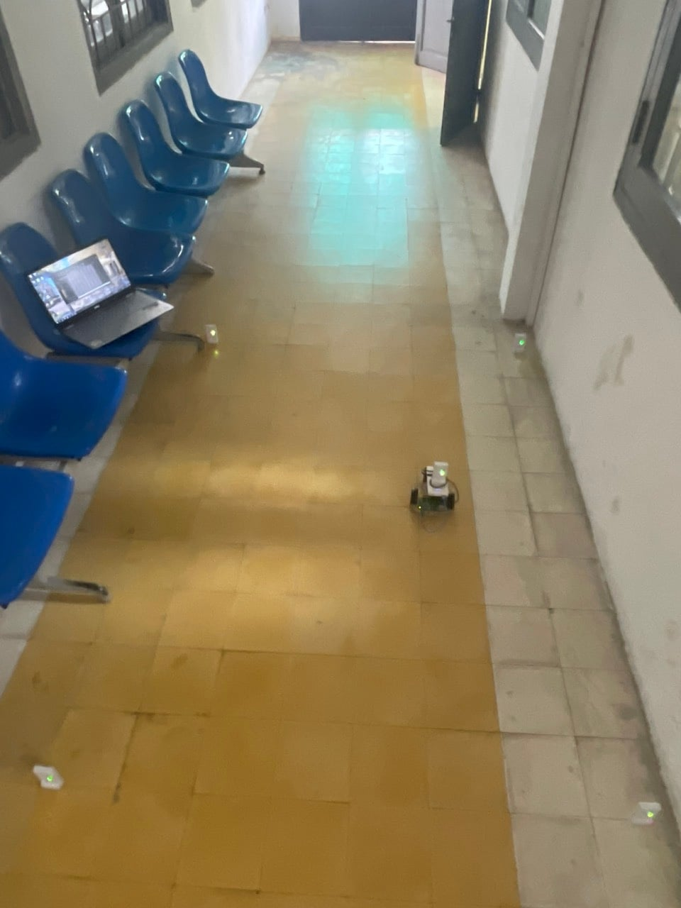

# Robot-Indoor-Localization
This project using DWM1001C to make indoor localization system apply Webserver tracking and Robot control

## Basic pyQT5 GUI real time tracking

## Small setup with 4 anchor and 1 tag connect to robot 

